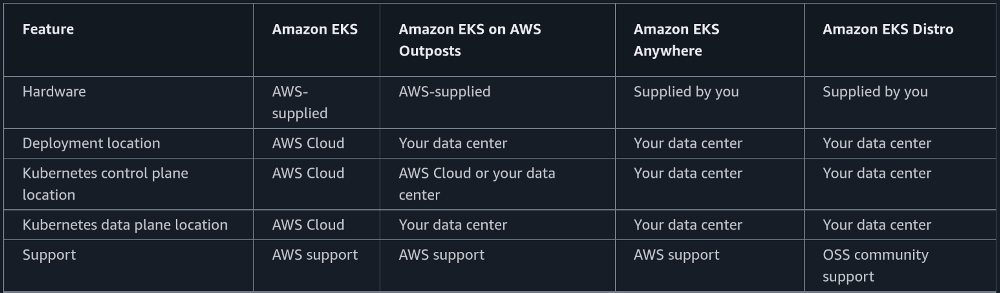
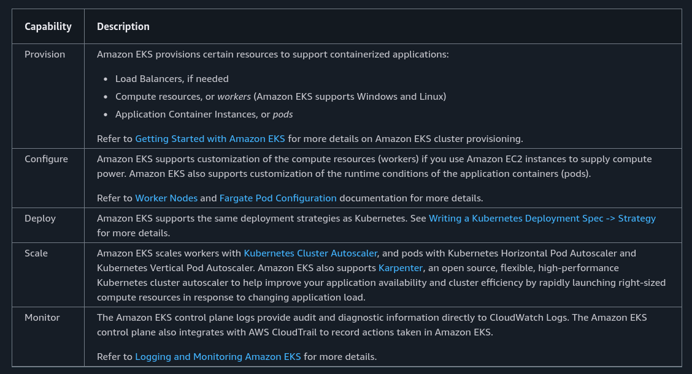
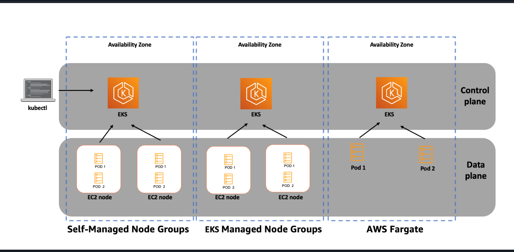

# EKS

**Amazon EKS (Elastic Kubernetes Service)** is a fully managed AWS service that lets you run **Kubernetes** without worrying about setting up or managing the control plane. AWS handles availability, security, and updates for you.

With **EKS**, you can:

* Deploy and manage containerized applications easily
* Monitor apps using **CloudWatch**
* Control access using **IAM**
* Scale workloads using **Auto Scaling**
* Run containers on **EC2 instances** or **AWS Fargate** (serverless)

**Amazon EKS control plane** is highly available and scalable, so your Kubernetes cluster stays reliable.

---

### **Amazon VPC Lattice with EKS**

**Amazon VPC Lattice** helps connect and secure services across **multiple clusters, VPCs, and AWS accounts**.
In EKS, it works using the **Kubernetes Gateway API**, making service-to-service communication simple, secure, and consistent.

---

### **Amazon EKS Deployment Options**

* **Amazon EKS Distro**
  Open-source Kubernetes distribution used by EKS. You can run it yourself anywhere.

* **Amazon EKS on AWS Outposts**
  Run Kubernetes on your **on-premises infrastructure** using AWS Outposts

  * *Extended cluster*: control plane in AWS, nodes on Outposts
  * *Local cluster*: everything runs on Outposts

* **Amazon EKS Anywhere**
  Run EKS-style Kubernetes **on-premises** or in your own data center, using the same tools and lifecycle as EKS.

---

---

**In short:**

Amazon EKS makes running Kubernetes on AWS easy, secure, and scalable—whether in the cloud, on-premises, or in hybrid environments.

---

## Simple deployment architecture

---