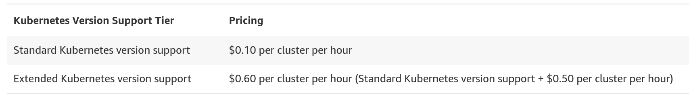

# **Amazon EKS Pricing**

Amazon **EKS pricing** depends on how you use the service:

---

### **What you pay for**

**1. EKS Cluster Cost**

* Charged **per cluster**
* Price depends on **Kubernetes version support**
* Separate pricing for **EKS Auto Mode** and **EKS Hybrid Nodes** (per vCPU)

**2. Infrastructure Cost (Paid Separately)**
EKS does **not** include compute or storage. You also pay for:

* **Amazon EC2** instances (worker nodes)
* **Amazon EBS** volumes (storage)
* **Public IPv4 addresses**
* **AWS Fargate** (if used)

Each resource is billed based on its own AWS pricing.

---

### **Important Notes**

* You pay only for the AWS services you actually use
* **Savings Plans** can reduce compute costs for EKS workloads
* Spot Instances can lower EC2 costs further

---

### **Pricing Pages to Check**

* **Amazon EKS**: cluster, Auto Mode, capabilities, hybrid nodes
* **Amazon EC2**: on-demand and spot pricing
* **AWS Fargate**: serverless container pricing

---
