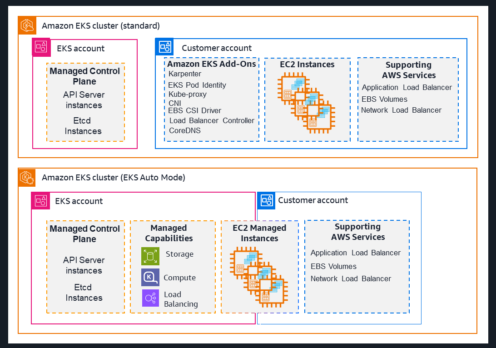

# What is EKS ?

**Amazon EKS: Simplified Kubernetes Management**

Amazon **Elastic Kubernetes Service (EKS)** is a fully managed Kubernetes service by AWS that removes the complexity of running and maintaining Kubernetes clusters.

With **Amazon EKS**, you can:

* Deploy applications faster with minimal setup
* Automatically scale applications as demand changes
* Improve security using built-in AWS services and automatic updates
* Run Kubernetes on AWS cloud or in your own data centers (EKS Anywhere / Hybrid)

---

### **Ways to use Amazon EKS**

**1. EKS Standard**

* AWS manages the Kubernetes **control plane**
* You manage worker nodes (EC2 or Fargate)
* AWS handles availability, scaling, and AWS integration

**2. EKS Auto Mode**

* AWS manages both **control plane and worker nodes**
* Automatically provisions infrastructure
* Chooses optimal compute instances
* Scales resources automatically
* Optimizes cost and patches operating systems
* Integrates with AWS security services

---

### **Features of Amazon EKS**

Amazon **Elastic Kubernetes Service (EKS)** provides many built-in features to make Kubernetes easier to use and manage.

---

### **Key Features**

**1. Management Interfaces**

* Manage clusters using **AWS Console, CLI, eksctl, CloudFormation, Terraform, SDKs, and CDK**
* Flexible options for automation and infrastructure as code

**2. Access Control**

* Uses **Kubernetes RBAC + AWS IAM**
* Secure access for users and applications running in the cluster

**3. Compute Resources**

* Supports all **EC2 instance types**
* Works with **Nitro** and **Graviton** for better performance and cost optimization

**4. Storage**

* Automatic **EBS storage classes** (in EKS Auto Mode)
* Supports **EBS, EFS, S3, FSx** using CSI drivers

**5. Security**

* Follows AWS **shared responsibility model**
* Strong integration with AWS security best practices

**6. Monitoring & Observability**

* Built-in monitoring using:

  * **CloudWatch**
  * **Prometheus**
  * **CloudTrail**
  * **ADOT Operator**

**7. Managed Cluster Capabilities**

* AWS manages Kubernetes controllers and components
* Automatic **patching, scaling, and monitoring**

**8. Kubernetes Compatibility**

* **CNCF-certified Kubernetes**
* Run standard Kubernetes apps without changes
* Standard and extended Kubernetes version support

---

### **AWS Services Commonly Used with EKS**

* **Amazon EC2** – compute for worker nodes
* **Amazon EBS** – block storage
* **Amazon ECR** – container image registry
* **Amazon CloudWatch** – logging and monitoring
* **Amazon Managed Prometheus** – metrics
* **Elastic Load Balancing** – traffic distribution
* **Amazon GuardDuty** – threat detection
* **AWS Resilience Hub** – resiliency assessment

---

